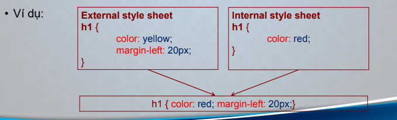

# Nội dung bài học
1. Phần 1: TỔNG QUAN VỀ CSS
1. PHẦN 2: CSS BACKGROUND
1. PHẦN 3: CSS TEXT
1. PHẦN 4: CSS FONT

# CÁC ĐỊNH DẠNG CSS CƠ BẢN

## Phần 1: TỔNG QUAN VỀ CSS

### 1. CSS là gì?

 * CSS viết tắt cho cụm từ Cascading Style Sheets
 * CSS viết tắt cho cụm từ Cascading Style Sheets
 * CSS định nghĩa cách thức hiển thị các phần tử HTML
 * Sử dụng CSS tiết kiệm thời gian cho thiết kế web
 * CSS có thể chứa trong một file văn bản không định dạng có phần mở rộng .css

### 2. Cú pháp CSS

* Cú pháp CSS gồm 2 phần: `selector` và `declaration` (pr`operty` và `value`)hay còn gọi là khối định dạng

```css
    Selector {
        property: value;
    }
```
* Khối định dạng: Chứa 1 hoặc nhiều khai báo, được ngăn cách với nhau bởi dấu chấm phẩy.
* Cú pháp của một khai báo: `property:value;`
* Nếu có nhiều khai báo thì mỗi khai báo nên viết trên một dòng.
* `Selector`: được sử dụng để xác định phần tử HTML cần định dạng. Ta có thể xác định một phần tử HTML thông qua tên (tag name), id, lớp (class), ... của phần tử đó.
* `Property`: là thuộc tính quy định cách trình bày. Ví dụ: background-color, font-family...
* `Value`: Giá trị của thuộc tính.
* Chú thích cho CSS: Dòng chú thích được đặt trong cặp dấu: /* chú thích */.

### 3. Một số selector hay sử dụng

* Element (tag name) selector: Sử dụng tên của thẻ HTML để xác định thẻ được định dạng thuộc tính.

    * Ví dụ:

```css
    h1 {
    text-align:center;
    color:red;
    }
```

* id selector:
    * Sử dụng thuộc tính id của thẻ HTML để lựa chọn thẻ được định dạng thuộc tính.
    * id nên là duy nhất trong một trang. Do đó, ta sử dụng id selector nếu ta muốn lựa chọn một phần tử duy nhất để định dạng.
    * Cú pháp của id selector là: `#id` của phần tử
    * Chú ý: Không đặt id bắt đầu bằng số
    * Ví dụ:
```css
    #css { 
        color:blue;
        text-align:center;
    }
```

* class selector:
    * Sử dụng thuộc tính class của các thành phần trong tài liệu HTML để lựa chọn cho các thành phần đó.
    * Sử dụng class selector cho một nhóm các thành phần có cùng định dạng giống nhau.
    * Cú pháp của class selector là: `.tên của class`
    * Ví dụ:

```css
    .web { 
        color:green;
        text-align:center;
    }
```

* universal selector `*`:
    * Khi muốn áp dụng thuộc tính định dạng với tất cả các thành phầntrong tài liệu HTML.
    * Cú pháp của universal selector là: `*{thuộc tính1:giá trị1; ,...}`
    * Ví dụ:

```css
    * { 
        color:yellow;
        text-align:center;
    }
```

* descendant selector:
    * Sử dụng khi muốn áp dụng các thuộc tính định dạng với tất cả các thành phần là con (hậu duệ) của một thành phần khác. Hậu duệ có thể được lồng rất sâu.
    * Cú pháp của descendant selector là: `.cha .con{thuộc tính1:giá trị1; ,...}`
    * Ví dụ:

```css
    .container .hello-class{ 
        color:red;
    }
```

* child selector :
    * Không giống như Descendant Selector, Child Selector được sử dụng khi muốn áp dụng thuộc tính định dạng với tất cả các thành phần là con (hậu duệ) trực tiếp của một thành phần khác.
    * Cú pháp của child selector là: `cha>con{thuộc tính1:giá trị1; ,...}`
    * Ví dụ:

```css
    .paragraph-container > .hello-class{ 
        color:blue;
    }
```

### 4. GROUPING SECLECTOR 

* Trong trường hợp các class hay id đều có các thuộc tính giống nhau thì ta sử dụng group(nhóm), các class, id cách nhau bhoiwr dấu `,`

* Ví dụ ban đầu:
```css
    h1 {
        text-align: center;
        color: red;
    }
    
    h2 {
        text-align: center;
        color: red;
    }

    p {
        text-align: center;
        color: red;
    }
```

* Grouping seclecters:
```css
    h1, h2, p {
        text-align: center;
        color: red;
    }
```

### 5. CSS làm việc như thế nào?

* Khi trình duyệt đọc CSS thì nó sẽ định dạng tài liệu dựa vào thông tin trong CSS.
    * Có 3 cách để chèn CSS vào tài liệu HTML
        * CSS nội tuyến (Inline CSS)
        * CSS bên trong (Internal CSS)
        * CSS bên ngoài (External CSS)

#### 1. Inline CSS

* Style được định nghĩa trong thuộc tính style của một thẻ. Sử dụng khi muốn định dạng xác định cho một thẻ. Nên tránh sử dụng, thay nó bằng id selector.
* Ví dụ:

```css
    <p style="background-color:red;">
        This is a heading.
    </h1
``` 

#### 2. Internal CSS sheets
* Style sheet được định nghĩa trong thẻ `<style>` đặt trong phần `head` của tài liệu HTML. Sử dụng khi một trang có định dạng khác với các trang khác.
* Ví dụ:

```css
    <head>
        <style>
            p.Two{
                background-color:blue;
            }
        </style>
    </head>
```

#### 3. External style sheet

* Style sheet được định nghĩa trong 1 file được soạn thảo bằng hệ soạn
thảo không định dạng (notepad) và lưu với phần mở rộng .css.
* Các trang web cần sử dụng định dạng cần tham chiếu đến file này bằng
cách sử dụng thẻ <link> đặt trong phần head có cú pháp như sau:

```html
    <link rel="stylesheet" type="text/css" href="đường dẫn và tên file .css">
```
* Sử dụng khi có nhiều trang web có định dạng giống nhau.

#### 4. MULTIPLE STYLE SHEETS

* Nếu một số thuộc tính cùng được định nghĩa cho một `selector` trong các `style sheets` khác nhau thì giá trị của nó sẽ được kế thừa từ những `style sheets` có độ ưu tiên cao hơn.



#### 5. THỨ TỰ ƯU TIÊN CỦA CÁC STYLE SHEETS
* Style nào sẽ được sử dụng khi có nhiều hơn 1 style xác định cho một
thành phần HTML?
* Các Styles sẽ được sắp xếp (cascade) thành một style ảo duy nhất. Thứ
tự ưu tiên của các style như sau:
    * Inline style
    * Internal và external style
    * Browse default
* Giá trị của các thuộc tính trong style có độ ưu tiên cao sẽ ghi đè giá trị
thuộc tính trong style có độ ưu tiến thấp hơn.

## PHẦN 2: CSS BACKGROUND

### 1. Giới thiệu
* Sử dụng để tạo các hiệu ứng nền cho các thành phần HTML.
* Các thuộc tính của CSS [background](https://www.w3schools.com/cssref/css3_pr_background.asp)
    * background-color: https://www.w3schools.com/css/css_background.asp
    * background-image: https://www.w3schools.com/css/css_background_image.asp
    * background-repeat: https://www.w3schools.com/css/css_background_repeat.asp
    * background-attachment: https://www.w3schools.com/css/css_background_attachment.asp
    * background-size: https://www.w3schools.com/cssref/css3_pr_background-size.asp
    * background-position: https://www.w3schools.com/cssref/pr_background-position.asp

### 2. Ý NGHĨA CÁC THUỘC TÍNH

#### 1. background-color: 
* Xác định màu nền. Màu nền có thể xácđịnh bằng tên màu, rgb hoặc hexa (#ffffff).

```css
    P {
        background-color: blue;
    }
    h1{
        background-color:#0066FF;
    }
```

#### 2. background-image:
* Xác định ảnh nền. Giá trị của thuộc tính là: `url(ảnh nền)`.

```css

```

#### 3. background-repeat:
* Xác định ảnh nền có được lặp lại hay không. Giá trị của thuộc tính này có thể là:
    * repeat-x: lặp ảnh nền theo chiều ngang
    * repeat-y: lặp ảnh nền theo chiều đứng
    * repeat: lặp ảnh nền theo cả hai chiều (mặc định)
    * no-repeat: không lặp ảnh nên.

#### 4. background-attachment:
* Xác định ảnh có trôi hay cố định khi ta cuốn nội dung trang web hay không. Giá trị của thuộc tính này là:
    * scroll (default) : Ảnh nền sẽ cuộn cùng nội dung trang web, đây là giá trị mặc định.
    * fixed: Cố định ảnh nền so với nội dung trang web. Khi áp dụng giá trị này, ảnh nền sẽ đứng yên khi bạn đang cuộn trang web.

#### 4. background-size: 
* Thiết lập lại kích thước cho hình nền Giá trị của thuộc tính là: `width` `height`.

```css
    body {
        background-image: url(./anhnen.jpg);
        background-size: 101px 62px;
    }
```

#### 5. background-position: 
* Xác định vị trí bắt đầu của ảnh nền. Các giá trị có thể của thuộc tính này là:

    * `x% y%`: góc trên bên trái là 0% 0%, góc dưới bên phải là 100% 100%. Nếu xác định một giá trị thì giá trị còn lại là 50%. Giá trị mặc định là 0% 0%.
    *` xpos ypos`: xác định tọa độ của điểm bắt đầu của ảnh. Tọa độ của điểm góc
    trên bên trái là 0 0.
    * Các từ định nghĩa sẵn: `left top; left center; left bottom; right top; right center; right bottom; center top; center center; center bottom.`

## PHẦN 3: CSS TEXT

### 1. GIỚI THIỆU
* Sử dụng CSS text để định dạng cho văn bản như: màu chữ,
căn lề, thụt đầu các đoạn, khoảng cách giữa các ký tự trong
từ, khoảng cách giữa các từ trong câu, các hiệu ứng như gạch
chân, ...
    * [Text Color](https://www.w3schools.com/css/css_text.asp)
    * [Text Alignment](https://www.w3schools.com/css/css_text_align.asp)
    * [Text Decoration](https://www.w3schools.com/css/css_text_decoration.asp)
    * [Text Transformation](https://www.w3schools.com/css/css_text_transformation.asp)
    * [Text Spacing](https://www.w3schools.com/css/css_text_spacing.asp)
    * [Text Shadow](https://www.w3schools.com/css/css_text_shadow.asp)

### 2. Ý NGHĨA CÁC THUỘC TÍNH
#### 1. Color: Sử dụng thuộc tính này để đặt màu cho văn bản.

```css
    p {
        color: blue;
    }
    h1 {
        color:#ff0000;
    }
    h2 {
        color:rgb(0,255,255);
    }
```

#### 2. text-align: Sử dụng thuộc tính này để căn lề cho văn bản
[Tham khảo tại W3](https://www.w3schools.com/cssref/pr_text_text-align.ASP)

```css
    p {
        text-align: justify;    /* Stretches the lines so that each line has equal width (like in newspapers and magazines) */
    }
    h1 {
        text-align: right;  /* Aligns the text to the right */
    }
    h2 {
        text-align: center; /* Centers the text */
    }
    h3 {
        text-align: left;   /* Aligns the text to the left */
    }
```


#### 3. text-indent: Sử dụng thuộc tính này để thụt đầu đoạn văn bản.
[Tham khảo tại W3](https://www.w3schools.com/cssref/pr_text_text-indent.asp)

```html
    <head>
    <style>
        div.a {
        text-indent: 50px;
        }

        div.b {
        text-indent: -2em;
        }

        div.c {
        text-indent: 30%;
        }
    </style>
    </head>

    <body>

    <h1>The text-indent Property</h1>

    <h2>text-indent: 50px:</h2>
    <div class="a">
        <p>Lorem ipsum dolor sit amet, consectetur adipiscing elit. Etiam semper diam at erat pulvinar, at pulvinar felis blandit. Vestibulum volutpat tellus diam, consequat gravida libero rhoncus ut.</p>
    </div>

    <h2>text-indent: -2em:</h2>
    <div class="b">
        <p>Lorem ipsum dolor sit amet, consectetur adipiscing elit. Etiam semper diam at erat pulvinar, at pulvinar felis blandit. Vestibulum volutpat tellus diam, consequat gravida libero rhoncus ut.</p>
    </div>

    <h2>text-indent: 30%:</h2>
    <div class="c">
        <p>Lorem ipsum dolor sit amet, consectetur adipiscing elit. Etiam semper diam at erat pulvinar, at pulvinar felis blandit. Vestibulum volutpat tellus diam, consequat gravida libero rhoncus ut.</p>
    </div>

    </body>
```

### 4. text-decoration: Sử dụng thuộc tính này để thiết lập hoặc ghỡ bỏ hiệu ứng (gạch chân, gạch đầu,...) cho văn bản.
[Tham khảo tại W3](https://www.w3schools.com/jsref/prop_style_textdecoration.asp)


```css
    a  {
        text-decoration: none;  /* Defines a normal text. This is default */
    }
    h1 {
        text-decoration: overline;  /* 	Defines a line over the text */
    }
    h2 {
        text-decoration:underline;  /* Defines a line under the text */
    }
    h3 {
        text-decoration:line-through;   /* Defines a line through the text */
    }
```

### 5. text-transform: Sử dụng thuộc tính này để chuyển sang chữ thường hoặc chữ hoa.
[Tham khảo tại W3](https://www.w3schools.com/jsref/prop_style_textdecoration.asp)


```css
    p.uppercase {
        text-transform: uppercase;  /* All characters are transformed to uppercase */
    }
    p.lowercase {
        text-transform: lowercase;  /* All characters are transformed to lowercase */
    }
    p.capitalize {
        text-transform:capitalize;  /* The first character of each word is transformed to uppercase */
    }
```

### 6. letter-spacing: Sử dụng thuộc tính này để tăng hoặc giảm khoảng cách giữa các ký tự trong một từ.

```css
    p {
        letter-spacing: 2px;
    }
    h1{
        letter-spacing:-2px;
    }
```

### 7. word-spacing: Sử dụng thuộc tính này để tăng hoặc giảm khoảng cách giữa các từ trong văn bản.

```css
    p {
        word-spacing: 2px;
    }
    h1{
        word-spacing:-2px;
    }
```


### 8. line-height: Sử dụng thuộc tính này để tăng hoặc giảm khoảng cách giữa các dòng trong văn bản.

```css
    p.small{
        line-height: 90%;
    }
    p.big {
        line-height: 200%;
    }
```

### 9. direction: Sử dụng thuộc tính này để xác định hướng viết văn bản từ trái sang phải hoặc từ phải sang trái.

```css
    p.small{
        line-height: 90%;
    }
    p.big {
        line-height: 200%;
    }
```

### 10. text-shadow: tạo bóng cho văn bản.
* Cú pháp: `text-shadow: none|h-shadow v-shadow blur color|initial|inherit;`
* Trong đó
    * `h-shadow`: vị trí bóng ngang so với chữ, số âm sẽ đẩy lên trên và số dương sẽ đẩy xuống dưới
    * `v-shadow` : vị trí bóng dọc so với chữ, số âm sẽ đẩy lui phía sau và số dương sẽ đẩy tới phía trước
    * `blur-radius` : độ nhòe của chữ bóng, tính bằng pixel
    * `color` : màu sắc của bóng

```css
    h1 {
        text-shadow: 2px 2px 8px #FF0000;
    }
```

## PHẦN 4: CSS FONT

### 1. Giới thiệu

Dùng để xác định font family, font weight, font size và font style
của văn bản

* [Font Family](https://www.w3schools.com/css/css_font.asp): 
* [Web Safe Fonts](https://www.w3schools.com/css/css_font_websafe.asp)
* [Font Fallbacks](https://www.w3schools.com/css/css_font_fallbacks.asp)
* [Font Style](https://www.w3schools.com/css/css_font_style.asp)
* [Font Size](https://www.w3schools.com/css/css_font_size.asp)
* [Google Fonts](https://www.w3schools.com/css/css_font_google.asp)
* [Great Font Pairings](https://www.w3schools.com/css/css_font_pairings.asp)
* [Font Property](https://www.w3schools.com/css/css_font_shorthand.asp)

### 2. Ý NGHĨA CÁC THUỘC TÍNH

#### 1. Thuộc tính font-family: dùng để xác định font chữ cho văn
bản.
[Tham khảo tại W3](https://www.w3schools.com/css/css_font.asp)

```css
    p {
        font-family: "Times New Roman", Times,
        serif;
    }
```

#### 2. Thuộc tính `font-size`: dùng để xác định kích thước của chữ cho văn bản. Ta có thể sử dụng đơn vị đo là px, % hoặc em. bản.
[Tham khảo tại W3](https://www.w3schools.com/css/css_font_size.asp)

```css
    p.normal {
        font-size: 16px; /* cỡ chữ mặc định của trình duyệt web = 1em*/
    } 
    p.bigger {
        font-size: 1.5em;
    }
```

#### 3. Thuộc tính `font-style`: dùng để xác định kiểu chữ cho văn bản.
[Tham khảo tại W3](https://www.w3schools.com/css/css_font_style.asp)

```css
    p.normal {
        font-style: normal;
    }
    p.italic {
        font-style: italic;
    }
```

#### 4. Thuộc tính `font-weight`: dùng để xác định in đậm cho văn bản.
[Tham khảo tại W3](https://www.w3schools.com/cssref/pr_font_weight.asp)

```css
    p.normal {
        font-weight: normal;
    }
    p.bold {
        font-weight: bold;
    }
```

#### 5. Thuộc tính `font-variant`: dùng để xác định cho văn bản có in chữ hoa nhỏ (small cap) hay không.
[Tham khảo tại W3](https://www.w3schools.com/css/css_font_style.asp)

```css
    p.normal {
        font-variant: normal;
    }
    p.Small {
        font-variant: small-caps;
    }
```


