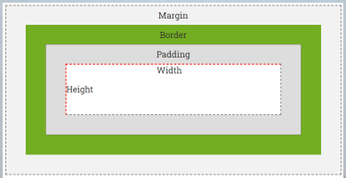

# Nội dung bài học
1. Phần 1. CSS BOX MODEL

# Phần 1. CSS BOX MODEL
* Mỗi một phần tử HTML sẽ bao gồm các thành phần: margin, border, padding, và content (nội dung của phần tử).
* Mỗi phần tử HTML được coi là một Box với các thành phần margin, border, padding, và content được gọi là Box model.
* Box model cho phép chúng ta thêm đường viền xung quanh phần tử , xác định khoảng cách giữa các phần tử...

* Ví dụ
```css
    div { 
        border:1px solid black;
        padding:30px;
        margin: 20px; 
    }
```

* CSS border dùng để thiết lập đường viền cho các thành phần html. Thuộc tính đường viền bao gồm: `border-style`, `border-width`, `border-color`.

## 1. `border-style`: thiết lập kiểu đường viền cho một phần tử.

```css
    p {
        border-style: solid;
    }
```

* Một số giá trị khác là: `none`, `dotted`, `dashed`, `double`...
    * `none` - Mặc đinh: không có đường viền
    * `dotted` - đường viền chấm
    * `dashed` - đường viền đứt nét
    * `solid` - đường viền vững chắc(liền)
    * `double` - đường viền kép
    * `groove` - đường viền có rãnh 3D. Hiệu ứng phụ thuộc vào giá trị màu viền
    * `ridge` - đường viền 3D. Hiệu ứng phụ thuộc vào giá trị màu viền
    * `inset` - đường viền in 3D. Hiệu ứng phụ thuộc vào giá trị màu viền
    * `outset` - đường viền ban đầu 3D. Hiệu ứng phụ thuộc vào giá trị màu viền
    * `hidden` - đường viền ẩn

* Chi tiết tại: [W3](https://www.w3schools.com/css/css_border.asp)
## 2. `border-width`: thiết lập độ dày của đường viền
```css
    p {
        border-width: 1px;
    }
```
## 3. `border-color`: thiết lập lại màu của đường viền

```css
    p {
        border-color: blue;
    }
```

## 4. viết tắt cho cả 3 thuộc tính đường viền như sau.

```css
    p {
        border: 1px solid blue;
    }
```

## 5. border-radius: xác định bán kính góc của phần tử

* Cú pháp: `border-radius: 1-4 length|% / 1-4 length|%|initial|inherit;`
* Ví dụ: 
```css
    #example1 {
        border: 2px solid red;
        border-radius: 25px;
    }

    #example2 {
        border: 2px solid red;
        border-radius: 50px 20px;
    }
```
[Tham khảo thêm tại W3](https://www.w3schools.com/cssref/css3_pr_border-radius.asp)

## 6. `border-collapse`: đặt các đường viền bảng nên thu gọn thành một đường viền duy nhất hay được phân tách như trong HTML chuẩn.

* Một số giá trị: 
    * `separate`:	Các đường viền được ngăn cách; mỗi ô sẽ hiển thị các đường viền riêng của nó
    * `collapse`:	Các đường viền được thu gọn thành một đường viền duy nhất khi có thể (border-spacing and empty-cells properties have no effect)	
[Tham khảo thêm tại W3](https://www.w3schools.com/cssref/pr_border-collapse.asp)


# Phần 2: CSS MARGIN

* Thuộc tính margin dùng để xác định khoảng trống nằm xung
quanh đường viền. Giá trị của thuộc tính margin có thể là:
    * `auto`: Trình duyệt từ xác định lề
    * `length`: Xác định lề là px, cm, pt, ... (giá trị mặc định là 0px).
    * `%:` Xác định lề là bao nhiêu % chiều rộng của đối tượng định đặt lề.

* Chúng ta có thể đặt lề cho riêng từng bên: trên, dưới, trái phải
```css
    p {
        margin-top: 100px;
        margin-right: 100px;
        margin-bottom: 150px;
        margin-left: 50px;
    }
```

* Chúng ta có thể xác định lề cho cả 4 phía như sau.
```css
    p.ex1 {
        margin: 25px 50px 75px 100px;
            /* top margin is 25px
            right margin is 50px
            bottom margin is 75px
            left margin is 100px */
    }
    p.ex2 {
        margin: 25px 50px 75px;
            /* top margin is 25px
            right and left margins are 50px
            bottom margin is 75px */
    }
    p.ex3 {
        margin: 25px 50px;
            /* top and bottom margins are 25px
            right and left margins are 50px */
    }
    p.ex3 {
        margin: 25px;
            /* all four margins are 25px */
    }
```

* [Tham khảo thêm tại W3](https://www.w3schools.com/css/css_margin.asp)

# Phần 3: CSS PADDING

* Thuộc tính padding dùng để xác định khoảng trống nằm giữa đường viền và nội dung. Giá trị của thuộc tính này có thể là:
    * `length`: Định nghĩa padding cố định (px, pt, cm, em, ...).
    * `%`: Xác định % chiều dài của đối tượng cần padding.

* Chúng ta có thể đặt các khoảng đệm khác nhau cho tất cả bốn cạnh của phần tử
```css
    p {
        padding-top: 100px;
        padding-right: 100px;
        padding-bottom: 150px;
        padding-left: 50px;
    }
```

* Chúng ta có thể xác định vùng khoảng cách vùng đệm cho cả 4 phía như sau.
```css
    p.ex1 {
        padding: 25px 50px 75px 100px;
            /* top padding is 25px
            right padding is 50px
            bottom padding is 75px
            left padding is 100px */
    }
    p.ex2 {
        padding: 25px 50px 75px;
            /* top padding is 25px
            right and left paddings are 50px
            bottom padding is 75px */
    }
    p.ex3 {
        padding: 25px 50px;
            /* top and bottom paddings are 25px
            right and left paddings are 50px */
    }
    p.ex3 {
        padding: 25px;
            /* all four paddings are 25px */
    }
```

* [Tham khảo thêm tại W3](https://www.w3schools.com/css/css_padding.asp)

# Phần 4: CSS DIMENSION

* CSS dimension dùng để xác định chiều dài, chiều cao, chiều
dài, cao tối thiểu và tối đa cho các thành phần html.
    * Thuộc tính `width` dùng để thiết lập chiều `rộng` cho phần nội dung của phần tử.
    * Thuộc tính `height` dùng để thiết lập chiều `cao` cho phần nội dung của phần tử.
    * Thuộc tính max-width, min-width được dùng để thiết lập chiều rộng tối đa và tối thiểu cho phần tử.
    * Thuộc tính max-height, min-height dùng để thiết lập chiều cao tối đa và tối thiểu cho phần tử.

* Lưu ý: Chiều rộng và chiều cao không bao gồm phần padding, border, margin.


* Ví dụ:
```css
    p{ 
        height: 50px; 
        width: 300px; 
    }
    div {
        max-width: 300px;
        min-height: 50px;
    }
```

# Phần 5: CSS LINK
### Link có thể được định dạng bằng bất kỳ thuộc tính CSS nào (`color`, `font-family`, `background-color`,...)
* Ví dụ: 
```css
    a {
        color: #FF0000
    }
```

### Ngoài ra, ta còn định dạng cho 4 trạng thái của link:

* `a:link` – liên kết bình thường chưa được kích
* `a:visited` – Liên kết đã được kích
* `a:hover` – Liên kết khi người sử dụng di chuyển chuột vào
* `a:active` – Liên kết tại thời điểm kích chuột

* Ví dụ: [Tham khảo tại W3](https://www.w3schools.com/css/tryit.asp?filename=trycss_link)
```css
    /* unvisited link */
    a:link {
        color: red;
    }

    /* visited link */
    a:visited {
        color: green;
    }

    /* mouse over link */
    a:hover {
        color: hotpink;
    }

    /* selected link */
    a:active {
        color: blue;
    }
```

## Một số định dạng chung cho link: [Tham khảo thêm tại W3](https://www.w3schools.com/css/css_link.asp)

<br>

# Phần 6: CSS LISTS

* CSS list dùng để:
    * Thiết lập các bullet và numbering khác nhau cho danh sách không có
    thứ tự và có thứ tự.
    * Thiết lập hình ảnh cho bullet
* Để thiết lập bullet hay numbering cho danh sách ta sử dụng
thuộc tính `list-style-type`.
    * Ví dụ: [ tại W3](https://www.w3schools.com/css/tryit.asp?filename=trycss_list-style-type_ex)
```css
    ul.a {
        list-style-type: circle;
    }

    ul.b {
        list-style-type: square;
    }

    ol.c {
        list-style-type: upper-roman;
    }

    ol.d {
        list-style-type: lower-alpha;
    }
```
* Để thiết lập ảnh cho bullet ta sử dụng thuộc tính `list-style-image`.
    * Ví dụ: [ tại W3](https://www.w3schools.com/css/tryit.asp?filename=trycss_list-style-image)
```css
    ul {
        list-style-image: url('sqpurple.gif');
    }
```
* Để thiết lập vị trí hiển thị của bullet hay numbering ta sử dụng thuộc tính `list-style-position`.
    * Ví dụ: [ tại W3](https://www.w3schools.com/css/tryit.asp?filename=trycss_list-style-position)
```css
    ul.a {
        list-style-position: outside;   /* Ngoài  ds*/
    }

    ul.b {
        list-style-position: inside;    /* Trong ds*/
    }
```

### • Ví dụ viết vắn tắt cho thuộc tính của list là: list-style:
    * Ví dụ: [ tại W3](https://www.w3schools.com/css/tryit.asp?filename=trycss_list-style)
```css
    ul {
        list-style: square inside url("sqpurple.gif");
    }
```

# Phần 7: CSS TABLE

### 1. Dùng thuộc tính `border` để xác định đường viền cho bảng và các ô dữ liệu.
* Ví dụ: [tại W3](https://www.w3schools.com/css/tryit.asp?filename=trycss_table_border)
```css
    table, th, td {
        border: 1px solid black;
    }
```

### 2. Để `collapse` (gộp) đường viền của bảng ta sử dụng thuộc tính `border-collapse`
* Ví dụ: [tại W3](https://www.w3schools.com/css/tryit.asp?filename=trycss_table_border-collapse)
```css
    table {
        border-collapse: collapse;
    }
```

### 3. Thuộc tính `width` và `height` dùng để thiết lập chiều rộng của bảng và chiều cao của dòng.
* Ví dụ: [tại W3](https://www.w3schools.com/css/tryit.asp?filename=trycss_table_width)
```css
    table {
        width: 100%;
    }
    th {
        height: 50px;
    }
```

### 4. Thuộc tính `text-align` và `vertical-align` dùng để căn lề dữ liệu cho các ô trong bảng.
* Ví dụ: [thêm tại W3](https://www.w3schools.com/css/css_table_align.asp)
```css
    th {
        text-align: left;
    }
    td{
        vertical-align: middle;
    }
```

<br>

# Phần 8: CSS DISPLAY

### 1. CSS display dùng để xác định một thành phần html hiển thị như thế nào. Giá trị mặc đình của thuộc tính này là: `inline` và `block`.

### 2. Các phần tử mức `block`: Luôn bắt đầu ở dòng mới và chiếm toàn bộ độ rộng còn lại. Một số phần từ mức block là: `<div>`, `<h1>` đến `<h6>`, `<p>`, `<form>`, `<li>`, ...

### 3. Các phần tử `inline`: Không bắt đầu ở dòng mới và chỉ chiếm độ rộng cần thiết. Một số phần tử `inline` như: `<span>`, `<a>`, ``.

### 4. Ngoài giá trị `block` và `inline` còn có một số thuộc tính hay sử dụng khác như: `none`, `inline-block`.

### 5. Chúng ta có thể thay giá trị mặc định cho thuộc tính display 

<br>

# Phần 9: CSS POSITION

### `CSS position` dùng để xác định phương thức xác định vị trí cho các phần tử html. Giá trị của thuộc tính `position` là:
* `static`: Đây là giá trị mặc định của thuộc tính `position`, với giá trị này phần tử html hiển thị bình thường không có gì đặc biệt.
* `relative`: Xác định vị trí hiển thị của chúng có quan hệ với vị trí bình thường. Thông qua thiết lập các thuộc tính kèm theo: `left`, `right`, `top`, `bottom` (giữa hai thuộc tính `top & bottom` các bạn chỉ có thể sử dụng một thuộc tính, giữa hai thuộc tính `left & right` cũng tương tự như vậy.)
* `fixed`: Thiết lập kiểu hiển thị là cố định ngay cả khi ta cuốn trang web. Để thiết lập vị trí ta dùng kết hợp với các thuộc tính `left`, `right`, `top`, `bottom`
* `absolute`: Xác định vị trí hiển thị của chúng có quan hệ với vị trí của thẻ chứa chúng. Thông qua thiết lập các thuộc tính kèm theo: `left`, `right`, `top`, `bottom`.
* [Tham khảo chi tiết tại W3: ](https://www.w3schools.com/css/css_positioning.asp)

### `CSS float` dùng để xác định liệu một thành phần html có `float` (trôi) hay không. Giá trị của thuộc tính này là:
* `none`: phần tử không float (trôi) đi đâu cả đây là giá trị mặc định.
* `left`: phần tử sẽ float (trôi) sang trái.
* `right`: phần tử sẽ float (trôi) sang phải.
* [Tham khảo chi tiết tại W3: ](https://www.w3schools.com/css/css_float.asp)

### `CSS clear` dùng để xác định phía nào của phần tử mà `thành phần float không được phép float`. Giá trị của thuộc tính này thường là:
* `none`: bị ảnh hưởng bởi thuộc tính float từ phần tử phía trước nó
* `left`: không bị ảnh hưởng bởi thuộc tính float (với giá trị left) từ phần tử phía trước nó
* `right`: không bị ảnh hưởng bởi thuộc tính float (với giá trị right) từ phần tử phía trước nó
* `both`: không bị ảnh hưởng bởi thuộc tính float từ phần tử phía trước nó
* [Tham khảo chi tiết tại W3: ](https://www.w3schools.com/css/css_float_clear.asp)