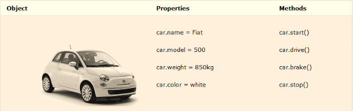

# Bài 6: Đối tượng trong Jvascript

# Nội dung bài học
1. PHẦN 1: GIỚI THIỆU VỀ ĐỐI TƯỢNG
1. PHẦN 2: CÁCH TẠO ĐỐI TƯỢNG
1. PHẦN 3: ĐỐI TƯỢNG NỘI TẠI TRONG JAVASCRIP
1. PHẦN 4: BOM, DOM HTML

# [Link tài liệu + video: ](https://drive.google.com/drive/folders/1pdNeASQkIt_G0GtH6FCozZnN6SzMI14l?usp=sharing)

## PHẦN 1: GIỚI THIỆU VỀ ĐỐI TƯỢNG
### Đối tượng là gì?
#### Về mặt định nghĩa, một đối tượng (object) là một danh sách các `thành phần`, mỗi thành phần là một cặp `tên` và `giá trị của nó`, trong đó `giá trị` có thể là: `các kiểu dữ liệu cơ bản`, `các hàm`, hay cũng có thể là `một đối tượng khác` (kiểu dữ liệu phức hợp)



#### Truy xuất vào thuộc tính của đối tượng
* Cú pháp
```js
    objectName.property      // person.age
```
or
```js
    objectName["property"]   // person["age"]
```
or
```js
    objectName[expression]   // x = "age"; person[x]
```
* Ví dụ 1: [tại w3](https://www.w3schools.com/js/tryit.asp?filename=tryjs_object_properties1)
```js
    person.firstname + " is " + person.age + " years old.";
```
* Ví dụ 2: [tại w3](https://www.w3schools.com/js/tryit.asp?filename=tryjs_object_properties2)
```js
    person["firstname"] + " is " + person["age"] + " years old.";
```
#### Truy xuất vào phương thức của đối tượng
* Cú pháp
```js
    objectName.methodName()      // person.fullName()
```

## PHẦN 2: CÁCH TẠO ĐỐI TƯỢNG
### 1. Khởi tạo đối tượng
Sử dụng khai báo và định nghĩa 1 đối tượng cố định: cách thức này thông qua cặp ngoặc nhọn “{…}”

* Ví dụ: [tại w3](https://www.w3schools.com/js/tryit.asp?filename=tryjs_object_create_1)
```js
    const person = {firstName:"John", lastName:"Doe", age:50, eyeColor:"blue"};
```
* Cách viết khác cho dễ nhìn: [tại w3](https://www.w3schools.com/js/tryit.asp?filename=tryjs_object_create_2)
```js
    const person = {
        firstName: "John",
        lastName: "Doe",
        age: 50,
        eyeColor: "blue"
    };
```

Sử dụng từ khóa `new`

* Ví dụ: [tại w3](https://www.w3schools.com/js/tryit.asp?filename=tryjs_object_create_new)
```js
    const person = new Object();
    person.firstName: "John",
    person.lastName: "Doe",
    person.age: 50,
    person.eyeColor: "blue"
```

Sử dụng phương thức tạo của đối tượng.

* Ví dụ: [tại w3](https://www.w3schools.com/js/tryit.asp?filename=tryjs_object_prototype1)
```js
    function person(first, last, age, eye) {
        this.firstName = first;
        this.lastName = last;
        this.age = age;
        this.eyeColor = eye;
    }
    const myFather = new person("John", "Doe", 50. "blue");
    const myMother = new person("Sally", "Rally", 48. "green");
```

Thêm phương thức cho đối tượng được thực hiện thông qua phương thức tạo của đối tượng
* Ví dụ:
```js
    function person(first, last, age, eye) {
        this.firstName = first;
        this.lastName = last;
        this.age = age;
        this.eyeColor = eye;
        // Phương thức thay đổi tên
        this.changeName = function (name) {
            this.lastName = name
        }
    }
    const myFather = new person("John", "Doe", 50. "blue");
    const myMother = new person("Sally", "Rally", 48. "green");
```

Tạo Object prototype bằng cách sử dụng phương thức tạo
* Cách 1: Thêm trực tiếp vào phương thức tạo đối tượng
* Ví dụ: [tại w3](https://www.w3schools.com/js/tryit.asp?filename=tryjs_object_prototype4)
```js
    function Person(first, last, age, eyecolor) {
        this.firstName = first;
        this.lastName = last;
        this.age = age;
        this.eyeColor = eyecolor;
        this.nationality = "English";
    }
```

* Cách 2: sử dụng thuộc tính prototype
* Ví dụ 1: [tại w3](https://www.w3schools.com/js/tryit.asp?filename=tryjs_object_prototype5)
```js
    function Person(first, last, age, eye) {
        this.firstName = first;
        this.lastName = last;
        this.age = age;
        this.eyeColor = eye;
    }

    Person.prototype.nationality = "English"; 
```
* Ví dụ 2: [tại w3](https://www.w3schools.com/js/tryit.asp?filename=tryjs_object_prototype6)
```js
    function Person(first, last, age, eyecolor) {
        this.firstName = first;
        this.lastName = last;
        this.age = age;
        this.eyeColor = eyecolor;
    }

    Person.prototype.name = function() {
        return this.firstName + " " + this.lastName;
    };
```

[Tham khảo chi tiết tại W3](https://www.w3schools.com/js/js_object_prototypes.asp)

## PHẦN 3: ĐỐI TƯỢNG NỘI TẠI TRONG JAVASCRIP
### 1. Đối tượng Math

Đối tượng Math là nơi xử lý các vấn đề toán học. Đối tượng này được sử dụng trực tiếp thông qua tên của nó mà không cần phải khởi tạo đối tượng
* Ví dụ: [tại w3](https://www.w3schools.com/js/tryit.asp?filename=tryjs_math_pi)
```js
    Math.PI;      // returns 3.141592653589793
```

Đối tượng Math bao gồm các thuộc tính là các hằng số toán học như PI, LOG2E, SQRT2 ...

* Ví dụ: [tại w3](https://www.w3schools.com/js/tryit.asp?filename=tryjs_math_constants)
```js
    Math.E        // returns Euler's number
    Math.PI       // returns PI
    Math.SQRT2    // returns the square root of 2
    Math.SQRT1_2  // returns the square root of 1/2
    Math.LN2      // returns the natural logarithm of 2
    Math.LN10     // returns the natural logarithm of 10
    Math.LOG2E    // returns base 2 logarithm of E
    Math.LOG10E   // returns base 10 logarithm of E
```

Đối tượng Math cũng chứa các phương thức là các hàm số toán học mà Javascript đã định nghĩa sẵn như `sin()`, `cos()`, `round()`…

| Method	                |Description|
| ---------                 | ----------|
| `abs(x)`	                | Returns the absolute value of x |
| `acos(x)`	                | Returns the arccosine of x, in radians |
| `acosh(x)`	            | Returns the hyperbolic arccosine of x |
| `asin(x)`	                | Returns the arcsine of x, in radians |
| `asinh(x)`	            | Returns the hyperbolic arcsine of x |
| `atan(x)`	                | Returns the arctangent of x as a numeric value between -PI/2 and PI/2 radians |
| `atan2(y, x)`	            | Returns the arctangent of the quotient of its arguments |
| `atanh(x)`	            | Returns the hyperbolic arctangent of x |
| `cbrt(x)`	                | Returns the cubic root of x |
| `ceil(x)`	                | Returns x, rounded upwards to the nearest integer |
| `cos(x)`	                | Returns the cosine of x (x is in radians) |
| `cosh(x)`	                | Returns the hyperbolic cosine of x |
| `exp(x)`	                | Returns the value of Ex |
| `floor(x)`	            | Returns x, rounded downwards to the nearest integer |
| `log(x)`	                | Returns the natural logarithm (base E) of x |
| `max(x, y, z, ..., n)`	| Returns the number with the highest value |
| `min(x, y, z, ..., n)`	| Returns the number with the lowest value |
| `pow(x, y)`	            | Returns the value of x to the power of y |
| `random()`	            | Returns a random number between 0 and 1 |
| `round(x)`	            | Rounds x to the nearest integer |
| `sign(x)`	                | Returns if x is negative, null or positive (-1, 0, 1) |
| `sin(x)`	                | Returns the sine of x (x is in radians) |
| `sinh(x)`	                | Returns the hyperbolic sine of x |
| `sqrt(x)`	                | Returns the square root of x |
| `tan(x)`	                | Returns the tangent of an angle |
| `tanh(x)`	                | Returns the hyperbolic tangent of a number |
| `trunc(x)`	            | Returns the integer part of a number (x) |

[Tham khảo chi tiết tại W3](https://www.w3schools.com/js/js_math.asp)

### 2. Đối tượng Date
Đối tượng `Date` là nơi xử lý các vấn đề về thời gian

Đối tượng `Date` được khởi tạo ra bởi câu lệnh `new`
* Ví dụ: [tại w3](https://www.w3schools.com/js/tryit.asp?filename=tryjs_date_current)
```js
    const d = new Date();
```
[Tham khảo chi tiết tại W3](https://www.w3schools.com/js/js_dates.asp)

Đối tượng `Date` thường được sử dụng thông qua các phương thức của nó. Có thể kể đến hai
nhóm phương thức là `phương thức get` và `phương thức set`

* Get Date Methods:

| Method	            | Description |
|----------             | ----------- |
| `getFullYear()`	    | Get the `year` as a four digit number (yyyy) |
| `getMonth()`	        | Get the `month` as a number (0-11) |
| `getDate()`	        | Get the `day` as a number (1-31) |
| `getHours()`	        | Get the `hour` (0-23) |
| `getMinutes()`	    | Get the `minute` (0-59) |
| `getSeconds()`	    | Get the `second` (0-59) |
| `getMilliseconds()`	| Get the `millisecond` (0-999) |
| `getTime()`	        | Get the `time` (milliseconds since January 1, 1970) |
| `getDay()`	        | Get the `weekday` as a number (0-6) |
| `Date.now()`	        | Get the `time`. ECMAScript 5. |

[Tham khảo chi tiết tại W3](https://www.w3schools.com/js/js_date_methods.asp)

* Set Date Methods:

| Method	| Description   |
| ---       | ---           |
| `setDate()`	        | Set the day as a number (1-31) |
| `setFullYear()`	    | Set the year (optionally month and day) |
| `setHours()`	        | Set the hour (0-23) |
| `setMilliseconds()`	| Set the milliseconds (0-999) |
| `setMinutes()`	    | Set the minutes (0-59) |
| `setMonth()`	        | Set the month (0-11) |
| `setSeconds()`	    | Set the seconds (0-59) |
| `setTime()`	        | Set the time (milliseconds since January 1, 1970) |

[Tham khảo chi tiết tại W3](https://www.w3schools.com/js/js_date_methods_set.asp)

Ngoài ra còn có `Date Formats`: [bạn có thể tham khảo chi tiết tại W3](https://www.w3schools.com/js/js_date_formats.asp)

### 3. Đối tượng String

Đối tượng `String` giúp bạn làm việc với một dãy các ký tự; nó giúp xử lý các kiểu dữ liệu chuỗi gốc trong JavaScript với một số phương thức giúp đỡ

Để tạo đối tượng `String` ta sử dụng cách `khai báo biến` hoặc qua từ khóa `new`

Một số thuộc tính và phương thức thông dụng của đối tượng String gồm: `length`, `charAt()`, `charCodeAt()`, `concat()`, `indexOf()`, ….

Bên cạnh đó các thẻ HTML như `<b>`, `<link>`, `<sub>` … cũng được coi là một thuộc tính của đối tượng String

### 3.1 JavaScript Strings
* Ví dụ: [tại w3](https://www.w3schools.com/js/js_strings.asp)
```js
    // A JavaScript string is zero or more characters written inside quotes.
    let text = "John Doe";

    // You can use single or double quotes:
    let carName1 = "Volvo XC60";  // Double quotes
    let carName2 = 'Volvo XC60';  // Single quotes

    // You can use quotes inside a string, as long as they don't match the quotes surrounding the string:
    let answer1 = "It's alright";               // result: It's alright
    let answer2 = "He is called 'Johnny'";      // result: He is called 'Johnny'
    let answer3 = 'He is called "Johnny"';      // result: He is called "Johnny"
```

### 3.2 Escape Character: 
Bởi vì chuỗi phải được viết trong dấu ngoặc kép, JavaScript sẽ hiểu sai chuỗi này:

| Code	| Result	| Description   |
| ---   | ---       | ---           |
| `\'`	| `'`       | Single quote  |
| `\"`	| `"`       | Double quote  |
| `\\`	| `\`       | Backslash     |

| Code	| Result    |
| ---   | ---       |
| `\b`	| Backspace |
| `\f`	| Form Feed |
| `\n`	| New Line  |
| `\r`	| Carriage Return   |
| `\t`	| Horizontal Tabulator  |
| `\v`	| Vertical Tabulator    |

### 3.2 String Length: trả về độ dài của chuỗi
* Ví dụ: [tại w3](https://www.w3schools.com/js/tryit.asp?filename=tryjs_string_length)
```js
    let text = "ABCDEFGHIJKLMNOPQRSTUVWXYZ";
    text.length;    // Will return 26
```

### 3.3 String Search: tìm kiếm chuỗi
#### 3.3.1 `String.indexOf()`: 
* Trả về `chỉ số` của (vị trí của) lần xuất hiện `đầu tiên` của một văn bản được chỉ định trong một chuỗi:
* Ví dụ: [tại w3](https://www.w3schools.com/js/tryit.asp?filename=tryjs_string_indexof)
```js
    let str = "Please locate where 'locate' occurs!";
    str.indexOf("locate")    // Returns 7
```
* trả về `-1` nếu không tìm thấy văn bản

#### 3.3.2 `String.lastIndexOf()`: 
* Trả về `chỉ số` của (vị trí của) lần xuất hiện `cuối cùng` của một văn bản được chỉ định trong một chuỗi:
* Ví dụ: [tại w3](https://www.w3schools.com/js/tryit.asp?filename=tryjs_string_lastindexof)
```js
    let str = "Please locate where 'locate' occurs!";
    str.lastIndexOf("locate")    // Returns 21
```
* trả về `-1` nếu không tìm thấy văn bản

#### 3.3.3 `String.search()`: 
* Tìm kiếm một chuỗi cho một giá trị được chỉ định và trả về vị trí của kết quả khớp:
* Ví dụ: [tại w3](https://www.w3schools.com/js/tryit.asp?filename=tryjs_string_search_locate)
```js
    let str = "Please locate where 'locate' occurs!";
    str.search("locate")     // Returns 7
```

### 3.4 String Methods
#### 3.4.1 The slice() Method
* Trích xuất một phần của chuỗi
* Trả về phần được trích xuất trong một chuỗi mới
* Phương thức nhận 2 tham số: vị trí bắt đầu và vị trí kết thúc
* Ví dụ: [tại w3](https://www.w3schools.com/js/tryit.asp?filename=tryjs_string_slice)
```js
    let str = "Apple, Banana, Kiwi";
    str.slice(7, 13)     // Returns Banana
```

* Ví dụ: [tại w3](https://www.w3schools.com/js/tryit.asp?filename=tryjs_string_slice_negative)
```js
    // Nếu một tham số là số âm, vị trí được tính từ cuối chuỗi.
    let str = "Apple, Banana, Kiwi";
    str.slice(-12, -6)    // Returns Banana
```

* Ví dụ: [tại w3](https://www.w3schools.com/js/tryit.asp?filename=tryjs_string_slice_rest)
```js
    // Nếu bạn bỏ qua tham số thứ hai, phương thức sẽ loại bỏ phần còn lại của chuỗi:
    let str = "Apple, Banana, Kiwi";
    str.slice(7);    // Returns Banana,Kiwi
```

#### 3.4.2 The substring() Method
* substr() is similar to slice().
* Sự khác biệt là substring() không thể chấp nhận các chỉ số âm.
* Ví dụ: [tại w3](https://www.w3schools.com/js/tryit.asp?filename=tryjs_string_substring)
```js
    let str = "Apple, Banana, Kiwi";
    substring(7, 13)    // Returns Banana
```

#### 3.4.3 The substr() Method
* substring() is similar to slice().
* Sự khác biệt là tham số thứ hai chỉ định độ dài của phần được trích xuất.
* Ví dụ: [tại w3](https://www.w3schools.com/js/tryit.asp?filename=tryjs_string_substr)
```js
    let str = "Apple, Banana, Kiwi";
    str.substr(7, 6)    // Returns Banana
```

### 3.5 Replacing String Content
* Phương thức replace() thay thế một giá trị được chỉ định bằng một giá trị khác trong một chuỗi:
* Chỉ thay thế kết quả phù hợp đầu tiên
* Có phân biệt chữ hoa chữ thường
* Ví dụ: [tại w3](https://www.w3schools.com/js/tryit.asp?filename=tryjs_string_replace)
```js
    let text = "Please visit Microsoft and Microsoft!";
    let newText = text.replace("Microsoft", "W3Schools");   // Please visit W3Schools and Microsoft!
```

* Để thay thế phân biệt chữ hoa chữ thường, hãy sử dụng biểu thức chính quy  `/i`
    * Ví dụ: [tại w3](https://www.w3schools.com/js/tryit.asp?filename=tryjs_string_replace_insensitive)
```js
    let text = "Please visit Microsoft!";
    let newText = text.replace(/MICROSOFT/i, "W3Schools");   // Please visit W3Schools!
```

* Để thay thế tất cả các kết quả phù hợp, hãy sử dụng biểu thức chính quy  `/g`
    * Ví dụ: [tại w3](https://www.w3schools.com/js/tryit.asp?filename=tryjs_string_replace_global)
```js
    let text = "Please visit Microsoft and Microsoft!";
    let newText = text.replace(/Microsoft/g, "W3Schools");   // Please visit W3Schools and W3Schools!
```
### 3.6 Converting to Upper and Lower Case
#### 3.6.1 String.toUpperCase(): chuyển đổi chữ thành chữ hoa
* Ví dụ: [tại w3](https://www.w3schools.com/js/tryit.asp?filename=tryjs_string_toupper)
```js
    let text1 = "Hello World!";       // String
    let text2 = text1.toUpperCase();  // text2 is "HELLO WORLD!"
```

#### 3.6.1 String.toLowerCase(): chuyển đổi chữ thành chữ thường
* Ví dụ: [tại w3](https://www.w3schools.com/js/tryit.asp?filename=tryjs_string_tolower)
```js
    let text1 = "Hello World!";       // String
    let text2 = text1.toLowerCase();  // text2 is "hello world!"
```

### 3.7 The concat() Method: Nối chuỗi
* Ví dụ: [tại w3](https://www.w3schools.com/js/tryit.asp?filename=tryjs_string_concat)
```js
    let text1 = "Hello";
    let text2 = "World";
    let text3 = text1.concat(" ", text2);   // Hello World!
```
* Phương thức concat () có thể được sử dụng thay cho toán tử cộng. Hai dòng này thực hiện tương tự nhau:
```js
    text = "Hello" + " " + "World!";
    text = "Hello".concat(" ", "World!");
```

### 3.8 String.trim(): loại bỏ khoảng trắng 2 bên của chuỗi
* Ví dụ: [tại w3](https://www.w3schools.com/js/tryit.asp?filename=tryjs_string_trim)
```js
    let text = "       Hello World!        ";
    text.trim()    // Returns "Hello World!"
```

### 3.9 JavaScript String Padding
* ECMAScript 2017 đã thêm hai phương thức Chuỗi: `padStart` và `padEnd` để hỗ trợ đệm ở đầu và cuối chuỗi.
* Ví dụ: [tại w3](https://www.w3schools.com/js/tryit.asp?filename=tryjs_string_padding1)
```js
    let text = "5";
    text.padStart(4,0)    // Returns 0005
```
* Ví dụ: [tại w3](https://www.w3schools.com/js/tryit.asp?filename=tryjs_string_padding2)
```js
    let text = "5";
    text.padEnd(4,0)     // Returns 5000
```

### 3.10 Extracting String Characters
#### 3.10.1 The charAt() Method
* Trả về ký tự tại một chỉ số (vị trí) được chỉ định trong một chuỗi:
* Ví dụ: [tại w3](https://www.w3schools.com/js/tryit.asp?filename=tryjs_string_charat)
```js
    let text = "HELLO WORLD";
    text.charAt(0)           // Returns H   
```

#### 3.10.2 The charCodeAt() Method
* trả về mã unicode của ký tự tại một chỉ mục được chỉ định trong một chuỗi:
* Ví dụ: [tại w3](https://www.w3schools.com/js/tryit.asp?filename=tryjs_string_charcodeat)
```js
    let text = "HELLO WORLD";
    text.charCodeAt(0)       // Returns 72
```

#### 3.10.3 Property Access
* ECMAScript 5 (2009) cho phép truy cập thuộc tính [] trên các chuỗi:
* Ví dụ: [tại w3](https://www.w3schools.com/js/tryit.asp?filename=tryjs_string_prop)
```js
    let text = "HELLO WORLD";
    text[0]                   // returns H
```

### 3.11 Converting a String to an Array: Chuyển đổi chuổi thành một mảng
* Một chuỗi có thể được chuyển đổi thành một mảng bằng phương thức `split()`:
* Ví dụ: [tại w3]()
```js
    text.split(",")          // Split on commas
    text.split(" ")          // Split on spaces
    text.split("|")          // Split on pipe
    text.split("")           // Split in characters
```

### 3.12 JS String Template 
[Tham khảo chi tiết tại W3](https://www.w3schools.com/js/js_string_templates.asp)
#### 3.12.1 Back-Tics Syntax
* `Template Literals` sử dụng dấu tích (``) thay vì dấu ngoặc kép ("") để xác định một chuỗi:
* Ví dụ: [tại w3](https://www.w3schools.com/js/tryit.asp?filename=tryjs_templates)
```js
    let text = `Hello World!`;
```

#### 3.12.2 Quotes Inside Strings
* Với `template literals` bạn có thể sử dụng cả dấu ngoặc kép và dấu ngoặc kép bên trong một chuỗ
* Ví dụ: [tại w3](https://www.w3schools.com/js/tryit.asp?filename=tryjs_templates_quotes)
```js
    let text = `He's often called "Johnny"`;
```

#### 3.12.3 Multiline Strings
* `Template literals` cho phép các chuỗi nhiều dòng
* Ví dụ: [tại w3](https://www.w3schools.com/js/tryit.asp?filename=tryjs_templates_multiline)
```js
    let text =
    `The quick
    brown fox
    jumps over
    the lazy dog`;
```

#### 3.12.4 Interpolation
* `Template literals` cung cấp một cách dễ dàng để nội suy các biến và biểu thức thành chuỗi.
* Cú pháp
```js
    ${...}
```
* Variable Substitutions: `Template literals` cho phép các biến trong chuỗi
    * Ví dụ: [tại w3](https://www.w3schools.com/js/tryit.asp?filename=tryjs_templates_variables)
```js
    let firstName = "John";
    let lastName = "Doe";

    let text = `Welcome ${firstName}, ${lastName}!`;    // Welcome John, Doe!
```

* Expression Substitution: `Template literals` cho phép biểu thức trong chuỗi:
    * Ví dụ: [tại w3](https://www.w3schools.com/js/tryit.asp?filename=tryjs_templates_expressions)
```js
    let price = 10;
    let VAT = 0.25;

    let total = `Total: ${(price * (1 + VAT)).toFixed(2)}`;     // Total: 12.50
```

#### 3.12.5 HTML Templates
* Ví dụ: [tại w3](https://www.w3schools.com/js/tryit.asp?filename=tryjs_templates_html)
```js
    let header = "Templates Literals";
    let tags = ["template literals", "javascript", "es6"];

    let html = `<h2>${header}</h2><ul>`;
    for (const x of tags) {
    html += `<li>${x}</li>`;
    }

    html += `</ul>`;
```


### Tài liệu tham khảo chi tiết thêm tại w3schools:
* [JavaScript Strings](https://www.w3schools.com/js/js_strings.asp)
* [JavaScript String Methods](https://www.w3schools.com/js/js_string_methods.asp)
* [JavaScript String Search](https://www.w3schools.com/js/js_string_search.asp)
* [JavaScript Template Literals](https://www.w3schools.com/js/js_string_templates.asp)


## PHẦN 4: BOM, DOM HTML
### 1. BOM trong Javascript
#### 1.1 BOM là gì?
* BOM được viết tắt bởi cụm từ Brower Object Model – Mô hình đối tượng trình duyệt. BOM cho phép Javascript tương tác với trình duyệt web. Để thực hiện được việc này BOM sử dụng đối tượng `window`.

* Tất cả các đối tượng, hàm và biến trong Javascript sẽ tự động trở thành thuộc tính hoặc phương thức của `đối tượng window` như `biến toàn cục là thuộc tính` của window, `hàm toàn cục sẽ là phương thức` của window
#### 1.2 Thuộc tính của đối tượng window
* Một số `thuộc tính` của đối tượng window:

    * `window.innerHeight` - chiều cao bên trong của cửa sổ trình duyệt (tính bằng pixel). [Tham khảo chi tiết thêm tại W3](https://www.w3schools.com/js/js_window.asp)

    * `window.innerWidth` - chiều rộng bên trong của cửa sổ trình duyệt (tính bằng pixel). [Tham khảo chi tiết thêm tại W3](https://www.w3schools.com/js/js_window.asp)

    * `window.screen` - màn hình của giao diện, qua thuộc tính này có thể truy xuất lấy giá trị về chiều rộng, cao và nhiều thông số khác của màn hình mà khách truy cập (tính bằng pixel). [Tham khảo chi tiết thêm tại W3](https://www.w3schools.com/js/js_window_screen.asp)

    * `window.location` – xác định địa chỉ trang hiện tại (URL) của trình duyệt, qua thuôc tính này có thể chuyển hướng truy cập hoặc thực hiện một số thao tác khác với URL. [Tham khảo chi tiết thêm tại W3](https://www.w3schools.com/js/js_window_location.asp)

    * `window.history` – là thuộc tính chứa lịch sử trình duyệt, nó được thực hiện kết hợp với hai phương thức back() và forward(). [Tham khảo chi tiết thêm tại W3](https://www.w3schools.com/js/js_window_history.asp)

    * `window.navigator` - tượng chứa thông tin về trình duyệt của khách truy cập. [Tham khảo chi tiết thêm tại W3](https://www.w3schools.com/js/js_window_navigator.asp)

#### 1.3 Phương thức của đối tượng window
* Một số `phương thức` của đối tượng window:

    * ``window.open()` - mở một cửa sổ mới

    * ``window.close()` - đóng cửa sổ hiện tại

    * ``window.moveTo()` - di chuyển cửa sổ hiện tại

    * ``window.resizeTo()` - thay đổi kích thước cửa sổ hiện tại

    * ``window.alert()` – Hộp cảnh báo

    * ``window.confirm()` – hộp xác nhận

    * ``window.prompt()` – Hộp nhắc nhở


### 2. DOM HTML trong Javascript
#### 2.1 DOM HTML là gì?
* Khi một trang web được tải về, trình duyệt sẽ tạo ra một đối tượng DOM (document object model) của trang đó. 
* Các DOM HTML được tạo ra như một cây của các đối tượng. HTML DOM là một tiêu chuẩn cho cách lấy, thay đổi, thêm hoặc xóa các phần tử HTML


* [Tham khảo chi tiết tại W3](https://www.w3schools.com/js/js_htmldom.asp)

#### 2.2 Phương thức DOM HTML
* Các phương thức của DOM HTML là các hành động có thể thực hiện trên các phần tử HTML còn thuộc tính của nó là các giá trị của các phần tử đó.

* Các phổ biến nhất để truy cập vào một phần tử HTML là sử dụng id của phần tử thông qua phương thức getElementById()

* Cách lấy nội dung của một phần tử thông qua thuộc tính innerHTML. Thuộc tính này cũng cho phép thay thế nôi dung của các phần tử HTML

#### 2.3 Các phần tử DOM HTML
* Thông thường thông qua DOM HTML người lập trình thường thao tác với các phần tử HTML. Để thực hiện có thể qua các phương thức gồm có:

    * `document.getElementById()`: Tìm các phần tử HTML theo id

    * `document.getElementsByTagName()`: Tìm các phần tử HTML theo tên thẻ

    * `document.getElementsByClassName()`: Tìm các phần tử HTML theo tên lớp

    * `document.querySelectorAll()`: Tìm các phần tử HTML theo bộ chọn CSS

    * Tìm các phần tử HTML `theo tập các đối tượng` được tạo ra bởi cây đối tượng: document.anchors, document.body, document.documentElement, document.embeds, document.forms, document.head, document.images, document.links, document.scripts và tiêu đề tài liệu

#### 2.4 Tham khảo chi tiết tại W3
* [DOM intro](https://www.w3schools.com/js/js_htmldom.asp)
* [DOM Methods](https://www.w3schools.com/js/js_htmldom_methods.asp)
* [DOM Document](https://www.w3schools.com/js/js_htmldom_document.asp)
* [DOM Elements](https://www.w3schools.com/js/js_htmldom_elements.asp)
* [DOM HTML](https://www.w3schools.com/js/js_htmldom_html.asp)
* [DOM Forms](https://www.w3schools.com/js/js_validation.asp)
* [DOM CSS](https://www.w3schools.com/js/js_htmldom_css.asp)
* [DOM Animations](https://www.w3schools.com/js/js_htmldom_animate.asp)
* [DOM Events](https://www.w3schools.com/js/js_htmldom_events.asp)
